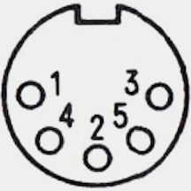
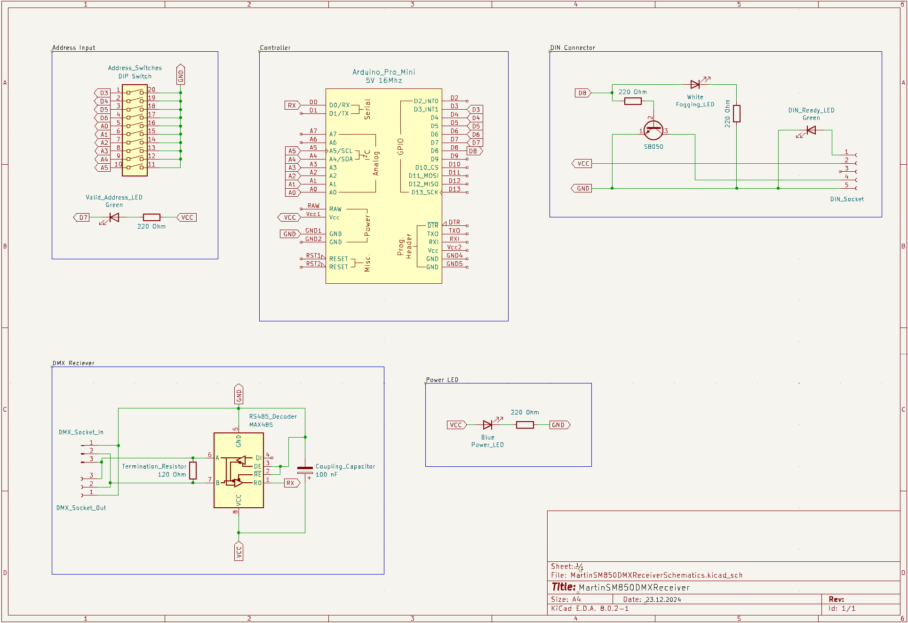

# Martin SM850 DMX-Receiver
Adapter from DMX to Martin fog control for Martin SM850

---

## User Manual
### Status LEDs
- Blue LED (Power_LED/"Power")
  - LED ON: Circuit powered
  - LED OFF: Circuit not powered
- Green LED (DIN_Ready_LED/"Ready")
  - LED ON: Fog machine ready
  - LED OFF: Fog machine not ready or not connected
- White LED (Fogging_LED/"Fogging")
  - LED ON: Currently sending a fogging signal
  - LED OFF: Currently not sending a fogging signal
- Green LED (Valid_Address_LED/"Adr. valid")
  - LED ON: DMX address valid
  - LED OFF: DMX address invalid

### DMX control
The fog machine is fogging when
- the value of the set DMX channel is greater than 250 and
- the set dmx address is valid and 
- the fog machine is ready (the fog signal will be sent independently of the ready state of the fog machine but the fog machine will deny it)

### DMX address
To set the DMX address use the 10 channel DIP Switch.
Each switch represents a number (see next table).

| Switch | 1 | 2 | 3 | 4 | 5  | 6  | 7  |  8  |  9  | 10  |
|:------:|:-:|:-:|:-:|:-:|:--:|:--:|:--:|:---:|:---:|:---:|
| Number | 1 | 2 | 4 | 8 | 16 | 32 | 64 | 128 | 256 | 512 |

The fog machine only needs one channel so the lowest possible DMX address is 1 and the highest possible DMX address is 512.
Addresses outside this range are invalid. This is shown by the green status LED next to the address input switches.

### Power
The power is taken by the DIN connection with the fog machine.

### Connecting
Connect the DIN connector with a 5 pin 180° DIN cable with the "WIRELESS CONTROLLER" connector of the fog machine.
Connect the DMX connector with one or two 3 pin DMX cable with your DMX bus topology.

---

## Martin SM850 Specifications
### Pin assignment of wireless controller DIN Connector



The picture is looking at the female connector in the fog machine.

| Pin | wireless receiver wire color |     function      | Voltage  |
|:---:|:----------------------------:|:-----------------:|:--------:|
|  1  |             red              | NOT READY / READY | 0V / +5V |
|  2  |            yellow            |        VCC        |   +5V    |
|  3  |             none             |       none        |   none   |
|  4  |             blue             |      FOGGING      |    0V    |
|  5  |            green             |        GND        |    0V    |

Short pin 4 and 5 to fog. <br>
Connect a LED directly connected to pin 1 (+/anode) and 5 (-/cathode) to get ready state.

---

## Hardware
### Components
#### Microcontroller
> 1x Arduino Pro Mini (ATmega328P) with 5V and 16MHz.

#### RS485 Converter
> 1x MAX485

#### Sockets
> 1x 5 pin 180° DIN socket

> 1x 3 pin DMX socket female

> 1x 3 pin DMX socket male

#### Other components
> 1x 10 channel DIP switch --> Input for DMX address

> 1x Transistor (e.g. S8050) --> Switching the fogging machine

> 2x LED green --> In-/Valid DMX address set, fog machine ready <br>
> 1x LED white --> Fogging indicator <br>
> 1x LED blue --> Power

> 4x 220 Ohm resistor --> Current limiting resistors for LEDs and transistor

> 1x 120 Ohm resistor --> Termination resistor

> 1x 100 nF capacitor --> Power stabilisation for MAX485 (coupling capacitor)

### Circuit design
#### DIP Switch
Least significant bit is Arduino[D3]. <br>
Most significant bit is Arduino[A5].
```
Arduino[D3] <-> DIP[1] <-> GND
Arduino[D4] <-> DIP[2] <-> GND
Arduino[D5] <-> DIP[3] <-> GND
Arduino[D6] <-> DIP[4] <-> GND
    
Arduino[A0] <-> DIP[5] <-> GND
Arduino[A1] <-> DIP[6] <-> GND
Arduino[A2] <-> DIP[7] <-> GND
Arduino[A1] <-> DIP[8] <-> GND
Arduino[A4] <-> DIP[9] <-> GND
Arduino[A5] <-> DIP[10] <-> GND
```
#### Status LEDs
```
Arduino[D7] <-> LED green <-> 220Ohm resistor <-> +5V
Arduino[VCC] <-> LED blue <-> 220Ohm resistor <-> GND
Arduino[D8] <-> LED white <-> 220Ohm resistor <-> GND
DIN[1] <-> LED green <-> GND
```

#### MAX485
```
MAX485[VCC] <-> Arduino[VCC]
MAX485[VCC] <-> 100nF capacitor <-> MAX485[GND]
MAX485[B] <-> DMX[2]
MAX485[A] <-> 120Ohm resistor <-> MAX[B]
MAX485[A] <-> DMX[3]
MAX485[GND] <-> Arduino[GND]
MAX485[GND] <-> DMX[1]

MAX485[RO] <-> Arduino[RXI]
MAX485[!RE] <-> Arduino[GND]
MAX485[DE] <-> Arduino[GND]
MAX485[DI]: <unconnected>
```

#### DIN Socket
```
DIN[4] <-> transistor[collector]
Arduino[D8] <-> 220Ohm resistor <-> transistor[base]
transistor[emitter] <-> GND
DIN[2] <-> Arduino[VCC]
DIN[5] <-> GND
```

### Schematics
